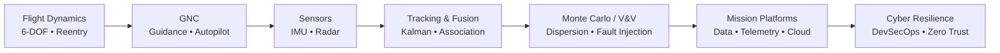

<div align="center">


[](https://github.com/skytruong90)


</div>

---

## `MISSION PROFILE // WHO I AM`

```yaml
Name        : David K. Tan
Role        : Software Engineer
Domain      : Aerospace + Defense Systems
Focus       : Modeling & Simulation | Mission Software | Secure Platforms
Core        : C++ | Python | Linux | Kubernetes | Cloud
Clearance   : Active
Objective   : Build secure, scalable, testable, and resilient systems
              for high-consequence engineering environments.
```

I build software at the intersection of **aerospace engineering, defense modeling & simulation, distributed systems, and cybersecurity**. My portfolio focuses on the full engineering chain: physics-based simulation, guidance and control, sensor processing, Monte Carlo analysis, mission data systems, and hardened cloud-native infrastructure.

<div align="center">


</div>

---

## `ENGINEERING DOMAINS`

<table>
<tr>
<td width="33%" valign="top">

### 🚀 Flight & GNC

- 6-DOF rigid-body dynamics
- Aerodynamics & propulsion models
- Guidance-law implementation
- Autopilot / control loops
- Quaternions & coordinate frames
- Atmospheric / reentry modeling

</td>
<td width="33%" valign="top">

### 📡 Sensors & Mission Systems

- Radar measurement simulation
- Kalman / state estimation
- Track management & association
- Distributed UDP systems
- Telemetry processing
- Mission visualization

</td>
<td width="33%" valign="top">

### 🛡️ Secure Platforms

- Linux & containers
- Kubernetes / Helm
- Infrastructure as Code
- DevSecOps automation
- Zero-trust concepts
- Cloud security architecture

</td>
</tr>
</table>

---

## `HOW THE PORTFOLIO CONNECTS`



---

## `FEATURED ENGINEERING SYSTEMS`

<div align="center">

<a href="https://github.com/skytruong90/Missile_Flight_Dynamics_Simulation">
  
</a>
<a href="https://github.com/skytruong90/sentineltrack">
  
</a>

<a href="https://github.com/skytruong90/Adversarial_Resilience_Testbed">
  
</a>
<a href="https://github.com/skytruong90/Atmospheric-Reentry-Simulator">
  
</a>

</div>

<table>
<tr>
<td width="50%" valign="top">

### 🚀 [Missile Flight Dynamics Simulation](https://github.com/skytruong90/Missile_Flight_Dynamics_Simulation)

A standalone **C++17 multi-rate 6-DOF flight simulation** with quaternion attitude dynamics, guidance laws, autopilot control, seeker modeling, deterministic Monte Carlo dispersion analysis, and automated validation.

`C++17` `CMake` `RK4` `GNC` `Monte Carlo` `48 validation checks`

</td>
<td width="50%" valign="top">

### 📡 [SentinelTrack](https://github.com/skytruong90/sentineltrack)

A distributed **radar and multi-sensor tracking system** with noisy detections, packet loss, Extended Kalman filtering, track management, UDP networking, Python mission visualization, and end-to-end CI testing.

`C++20` `EKF` `UDP` `Tracking` `Python` `44 automated tests`

</td>
</tr>
<tr>
<td width="50%" valign="top">

### 🛡️ [Adversarial Resilience Testbed](https://github.com/skytruong90/Adversarial_Resilience_Testbed)

A defensive aerospace **V&V / fault-injection simulation harness** that measures guidance-loop resilience against spoofing, jamming, replay, and drift while evaluating real-time integrity monitoring and mitigation.

`C++17` `ProNav` `CUSUM` `Fault Injection` `V&V` `CI`

</td>
<td width="50%" valign="top">

### 🔥 [Atmospheric Reentry Simulator](https://github.com/skytruong90/Atmospheric-Reentry-Simulator)

A documented **C++17 atmospheric-entry simulator** combining the 1976 Standard Atmosphere, Mach-dependent drag, Sutton-Graves convective heating, RK4 integration, and analysis-ready CSV output.

`C++17` `Atmosphere` `Hypersonics` `Heating` `RK4` `CMake`

</td>
</tr>
</table>

---

## `MORE FROM THE ENGINEERING LAB`

<div align="center">

[](https://github.com/skytruong90/6-DOF_Missile_Simulation)
[](https://github.com/skytruong90/IMU-Sensor-Model)
[](https://github.com/skytruong90/Flight-Data-Recorder)

[](https://github.com/skytruong90/mission-planning-dashboard)
[](https://github.com/skytruong90/Zero-Trust-Network-Architecture)
[](https://github.com/skytruong90/Azure-Sentinel-SIEM)

</div>

---

## `TECH STACK // SYSTEM TOOLKIT`

### Languages


### Modeling, Simulation & Engineering


### Cloud / DevOps / Infrastructure


### Systems / Tooling


---

## `ENGINEERING PRINCIPLES`

```text
[01] Make the physics and assumptions explicit.
[02] Prefer deterministic, reproducible simulations.
[03] Validate behavior — not just compilation.
[04] Treat interfaces, networking, and data contracts as first-class design problems.
[05] Automate regression tests and CI wherever practical.
[06] Build security into the architecture instead of bolting it on later.
[07] Document limitations as clearly as capabilities.
```

---

## `EDUCATION`

| Degree | Institution | Field |
|---|---|---|
| **M.S.** | Georgia Institute of Technology | Computer Science |
| **M.S.** | Colorado State University | Aerospace Engineering |
| **MBA** | Louisiana State University | Business Administration |
| **B.S.** | Valdosta State University | Computer Science |

---

## `CERTIFICATIONS`

<div align="center">

[](https://tinyurl.com/3jdcfhkp)

</div>

```text
[✓] PMP      — Project Management Professional
[✓] CISSP    — Certified Information Systems Security Professional
[✓] Sec+     — CompTIA Security+
[✓] Linux+   — CompTIA Linux+
```

---

## `GITHUB TELEMETRY`

<div align="center">

<picture>
  <source media="(prefers-color-scheme: dark)" srcset="https://raw.githubusercontent.com/skytruong90/skytruong90/output/github-contribution-grid-snake-dark.svg" />
  
</picture>

<br/><br/>


</div>

---

## `COMMS // CONNECT`

<div align="center">

[](https://davidktan.com)
[](mailto:david.k.tan2@gmail.com)
[](https://tinyurl.com/p8psyuhv)
[](https://tinyurl.com/3jdcfhkp)

<br/><br/>

```text
╔══════════════════════════════════════════════════════════════════════╗
║  AEROSPACE SOFTWARE • MODELING & SIMULATION • SECURE SYSTEMS       ║
║                    CLEARANCE VERIFIED • MISSION READY               ║
╚══════════════════════════════════════════════════════════════════════╝
```

</div>


