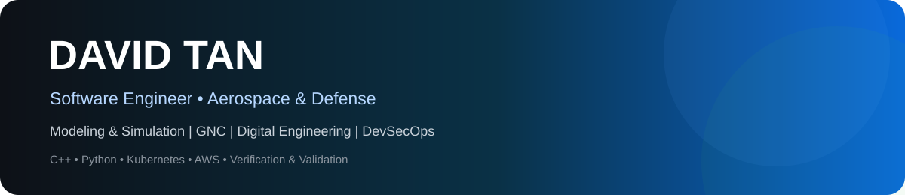

<div align="center">



# Aerospace software, simulation, digital engineering, and secure mission platforms


</div>

## About me

I build software at the intersection of aerospace engineering, modeling & simulation, digital engineering, software quality, and secure cloud-native infrastructure. My public GitHub portfolio uses synthetic, non-sensitive engineering scenarios to demonstrate how I approach simulation architecture, verification, telemetry, state estimation, automation, and resilient software delivery.

```text
Primary focus   Aerospace modeling & simulation
Engineering     Flight dynamics • GNC • sensors • Monte Carlo • digital twins
Software        C++ • Python • Linux • Git • automated testing
Platform        Containers • Kubernetes • CI/CD • infrastructure as code
Quality         Verification • regression testing • determinism • traceability
Security        DevSecOps • hardening • software supply-chain assurance
```

## Portfolio map

| Area | What the repositories demonstrate | Start here |
|---|---|---|
| Aerospace digital engineering | digital twins, simulation orchestration, model provenance | [Aerospace Digital Twin Platform](https://github.com/skytruong90/Aerospace-Digital-Twin-Platform) |
| Flight dynamics & GNC | deterministic dynamics, guidance/control, navigation, state estimation | [Multi-Rate 6DOF Flight Simulator](https://github.com/skytruong90/Multi-Rate-6DOF-Flight-Simulator) |
| Navigation & sensors | INS error propagation, GPS-denied operation, sensor faults and calibration | [GPS-Denied Navigation Lab](https://github.com/skytruong90/GPS-Denied-Navigation-Lab) |
| Verification & validation | SIL/HIL-style harnesses, Monte Carlo V&V, determinism, quality gates | [Flight Software Fault Injection Framework](https://github.com/skytruong90/Flight-Software-Fault-Injection-Framework) |
| Telemetry & analytics | recording, streaming, anomaly detection, data quality, health monitoring | [Flight Data Recorder](https://github.com/skytruong90/Flight-Data-Recorder) |
| Cyber-resilient aerospace | secure telemetry, avionics integrity, SBOM and supply-chain analysis | [Cyber-Resilient Avionics Bus](https://github.com/skytruong90/Cyber-Resilient-Avionics-Bus) |
| Mission platform engineering | Kubernetes, GitOps, observability, distributed simulation infrastructure | [Hardened Kubernetes Aerospace Lab](https://github.com/skytruong90/Hardened-Kubernetes-Aerospace-Lab) |

## Featured engineering projects

<table>
<tr>
<td width="50%">

### [Aerospace Digital Twin Platform](https://github.com/skytruong90/Aerospace-Digital-Twin-Platform)

A synthetic vehicle digital twin connecting flight-state propagation, noisy sensors, Kalman estimation, health monitoring, anomaly detection, replayable telemetry, and Monte Carlo analysis.

`Python` · `NumPy` · `State Estimation` · `Digital Engineering`

</td>
<td width="50%">

### [Multi-Rate 6DOF Flight Simulator](https://github.com/skytruong90/Multi-Rate-6DOF-Flight-Simulator)

A deterministic aerospace simulation architecture focused on multi-rate scheduling, state propagation, repeatable test scenarios, and analysis-ready outputs.

`Simulation` · `Flight Dynamics` · `V&V` · `CI`

</td>
</tr>
<tr>
<td width="50%">

### [GPS-Denied Navigation Lab](https://github.com/skytruong90/GPS-Denied-Navigation-Lab)

Synthetic navigation lab for studying inertial drift, intermittent aiding, navigation integrity, estimation error, and recovery behavior.

`Navigation` · `INS` · `Sensor Fusion` · `Monte Carlo`

</td>
<td width="50%">

### [Flight Data Recorder](https://github.com/skytruong90/Flight-Data-Recorder)

C++17 telemetry recorder/replay pipeline with a versioned binary format, event flags, corruption checks, CSV/JSON export, plotting, and automated tests.

`C++17` · `Telemetry` · `Binary I/O` · `CMake`

</td>
</tr>
<tr>
<td width="50%">

### [Cyber-Resilient Avionics Bus](https://github.com/skytruong90/Cyber-Resilient-Avionics-Bus)

Defensive aerospace software example centered on message integrity, validation, resilience monitoring, and auditable synthetic avionics traffic.

`Cybersecurity` · `Avionics` · `Integrity` · `Testing`

</td>
<td width="50%">

### [Defense Simulation Data Platform](https://github.com/skytruong90/Defense-Simulation-Data-Platform)

A simulation-data engineering project for reproducible ingestion, validation, lineage, analytics, and experiment-oriented data products.

`Data Engineering` · `Simulation` · `Provenance` · `Analytics`

</td>
</tr>
</table>

## Engineering themes across the portfolio

- **Modeling & simulation:** deterministic time stepping, coordinate/state representations, scenario configuration, uncertainty campaigns, and analysis outputs.
- **Guidance, navigation & control:** state estimation, navigation integrity, synthetic sensors, controller testbeds, and closed-loop simulation patterns.
- **Software quality:** unit/integration tests, regression harnesses, reproducibility checks, fault injection, requirements traceability, and CI quality gates.
- **Platform engineering:** container security, Kubernetes policy, GitOps, observability, distributed workloads, and infrastructure validation.
- **Cyber-resilience:** integrity checks, least privilege, software supply-chain analysis, secure telemetry, defensive anomaly monitoring, and hardening.
- **Data engineering:** telemetry pipelines, streaming events, data-quality rules, experiment tracking, provenance, and Monte Carlo analytics.

## How I structure portfolio repositories

Each substantial project is designed to answer four questions quickly:

1. **What engineering problem does this solve?** — the README starts with scope, assumptions, and architecture.
2. **Can I run it?** — projects include explicit setup/run commands and deterministic example scenarios.
3. **Can I trust the implementation?** — tests, validation, CI, and machine-readable outputs are included where appropriate.
4. **What did the project teach?** — READMEs document engineering lessons, tradeoffs, limitations, and next steps.

## Public-data / safety note

The aerospace and defense-themed repositories on this profile are public educational software projects. They use synthetic or generic parameters and are not representations of classified systems, real operational performance, targeting logic, flight-qualified software, or government certification.

## Connect

<div align="center">

[](https://davidktan.com)
[](mailto:david.k.tan2@gmail.com)
[](https://tinyurl.com/p8psyuhv)
[](https://tinyurl.com/3jdcfhkp)

</div>
